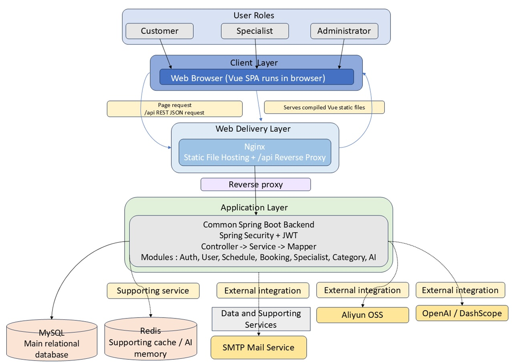

# ExpertLink: AI-Augmented Specialist Booking Platform

This repository contains the source code, database migrations, and local setup configurations for **ExpertLink**, an intelligent hospital specialist booking platform. The system leverages a robust Spring Boot backend, a Vue 3 frontend, and an AI assistance powered by LangChain4j and Redis Stack.


## Technical Badges
- **Backend:** Java 17 | Spring Boot 3.3.5 | MyBatis-Plus
- **Frontend:** Vue 3 | Vite | Element Plus | TypeScript
- **Database & Cache:** MySQL 8 | Redis Stack (RediSearch)
- **AI Integration:** LangChain4j
- **Quality & CI:** JUnit 5 | GitHub Actions

---

## Table of Contents
1. [Project Overview](#1-project-overview)
2. [Core Feature Modules](#2-core-feature-modules)
3. [System Architecture](#3-system-architecture)
4. [Local Development Prerequisites](#4-local-development-prerequisites)
5. [Local Installation and Startup](#5-local-installation-and-startup)
6. [Docker Deployment Guide](#6-docker-deployment-guide)
7. [API Documentation](#7-api-documentation)
8. [Login URLs and Test Accounts](#8-login-urls-and-test-accounts)

---

## 1. Project Overview
ExpertLink is a full-stack medical specialist booking platform designed for patient-facing appointment discovery, specialist-side schedule management, and administrator-side medical resource governance. Its core differentiator is AI-augmented workflow support, including semantic knowledge retrieval and conversational booking assistance that can safely hand off to structured UI flows.

---

## 2. Core Feature Modules
This section details the functional modules implemented across our three main development increments.

### Customer (C-End) 
- **Personalized Dashboard:** Usage summary, appointment trends, and upcoming booking visibility.
- **Booking Management:** Specialist search, booking creation, detail tracking, cancellation, and rescheduling flows.

### Specialist (S-End)
- **Schedule and Shift Management:** Recurring rules and time-slot operations for consultation availability.
- **Approval Queue:** Booking request handling, specialist review actions, and status progression.

### Administrator (B-End)
- **Medical Resource Control:** Management of expert directories, consultation fees, and categories.

### AI Assistant (Agentic Layer)
- **Semantic Search & FAQ (RAG):** Processing platform guidelines through structured Markdown splitting and vector database indexing.
- **Conversational Booking Agent:** Parameter extraction (slot filling) and AI-to-UI handoff for secure transactions.

---

## 3. System Architecture
ExpertLink follows a modular three-layer web architecture that cleanly separates user interaction, business orchestration, and data/middleware concerns.

### Architectural Diagram


### Component Descriptions
- **Presentation Layer (Vue 3, Element Plus, Pinia):** Role-based portals and business interaction pages.
- **Application Layer (Spring Boot, Spring Security, JWT, LangChain4j):** REST APIs, authorization, booking workflows, and AI orchestration.
- **Persistence & Middleware Layer (MySQL, Flyway, Redis Stack):** Transactional data storage, schema evolution, and AI/search cache capability.

---

## 4. Local Development Prerequisites
If developers wish to run the system natively outside of Docker, ensure the following are installed:
- Java Development Kit (JDK) 17
- Maven 3.9+ (or use `backend/mvnw`)
- Node.js (`^20.19.0 || >=22.12.0`) and npm
- MySQL Server (v8.0+)
- Redis Stack Server (recommended) or compatible Redis service

---

## 5. Local Installation and Startup
This section is aligned with the current repository setup and scripts.

### Option A: Recommended One-Command Local Dev (Windows)
Run:

```powershell
scripts\run-local-dev.cmd
```

Default endpoints:
- Frontend (Vite): `http://localhost:5331`
- Backend (Spring Boot dev): `http://localhost:8081`
- Swagger UI: `http://localhost:8081/swagger-ui/index.html`

This flow starts infrastructure services with Docker defaults:
- MySQL: `127.0.0.1:9001`
- Redis Stack: `127.0.0.1:9002`

### Option B: Manual Setup

#### Backend Setup
1. **Environment Variables**
Create root `.env` from `.env.example` and set required values:
- `DB_PASSWORD`
- `JWT_SECRET` (at least 32 characters)

Optional values (only for related features):
- AI: `OPENAI_API_KEY`, `DASHSCOPE_API_KEY` and model/base-url variables
- Email: `MAIL_PASSWORD`

If Redis runs locally outside Docker:
- `REDIS_HOST=127.0.0.1`
- `REDIS_PORT=6379`

2. **Database Migration**
Flyway migration runs automatically at backend startup (`spring.flyway.enabled=true`).
Before startup, create DB:

```sql
CREATE DATABASE IF NOT EXISTS cpt202_consultancy
DEFAULT CHARACTER SET utf8mb4
COLLATE utf8mb4_unicode_ci;
```

3. **Spring Boot Run**

```powershell
cd backend
./mvnw spring-boot:run
```

#### Frontend Setup
1. **Installing Dependencies**

```powershell
cd frontend
npm install
```

2. **Environment Files**
Use the project root `.env` and ensure frontend API base URL points to backend `/api` endpoint (for example `http://localhost:8081/api`).

3. **Vite Server Start**

```powershell
npm run dev
```

---

## 6. Docker Deployment Guide
For faster containerized setup or production-style deployment, refer to:

- [Go to Docker Setup Guide (README_DOCKER.md)](./README_DOCKER.md)

---

## 7. API Documentation
- Swagger UI: `http://localhost:8081/swagger-ui/index.html`
- OpenAPI JSON: `http://localhost:8081/v3/api-docs`

---

## 8. Login URLs and Test Accounts

### Login URLs
- Customer login: `http://localhost:5331/auth`
- Specialist login: `http://localhost:5331/auth/specialist`
- Admin login: `http://localhost:5331/auth/admin`

### Test Accounts
#### Admin
- Email: `test.admin@expertlink.com`
- Password: `Admin@123456`

#### Customer
- Email: `test.customer@expertlink.com`
- Password: `Test12345`

#### Specialist
This account is pre-configured on server environments and is **not automatically created** when running source code locally. 
If needed, log in as admin to add a specialist.
- Email: `test.specialist@expertlink.com`
- Password: `12345Expertlink`
